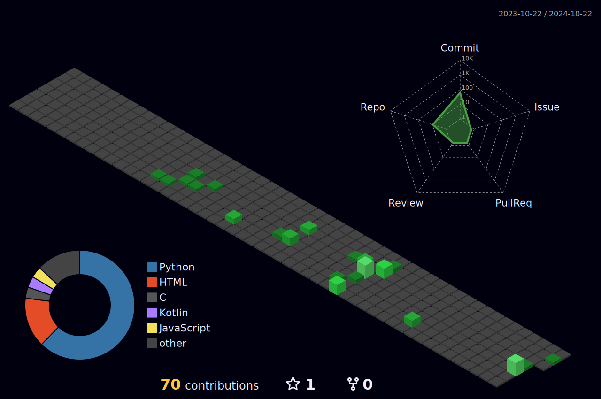

# Sup, I am Vinicius, backend Software Engineer!

## About me:

I'm a passionate programmer who loves to solve problems with creative solutions!

## My specialties:

       

## If there is something I dont know, give me a few days!
